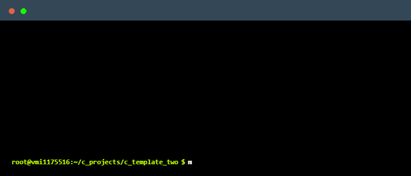
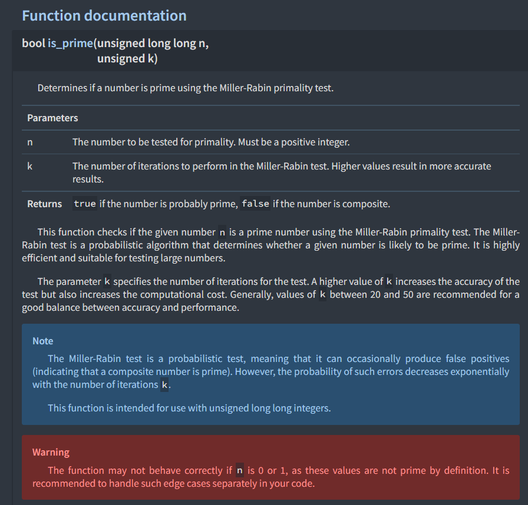

<div align="center"><h1>yet-another-c-template</h1></div>
<div align="center"><p><p></div>

<div align="center"></img></div>

<div align="center"><h3>🎉 Welcome to yet-another-c-template — your ultimate starting point for diving into the world of C programming with confidence and clarity! 🚀</h3></div>

<div align="center">
  <a href="https://opensource.org/licenses/MIT">
    
  </a>
  <a href="https://github.com/jymchng/yet-another-c-template/issues">
    
  </a>
  <a href="https://github.com/jymchng/yet-another-c-template/network">
    
  </a>
  <a href="https://github.com/jymchng/yet-another-c-template/stargazers">
    
  </a>
  <a href="https://github.com/jymchng/yet-another-c-template">
    
  </a>
  <a href="https://github.com/jymchng/yet-another-c-template/commits/main">
    
  </a>
  <a href="https://github.com/jymchng/yet-another-c-template/graphs/contributors">
    
  </a>
  <a href="https://github.com/jymchng/yet-another-c-template/pulls">
    
  </a>
  <a href="https://github.com/jymchng/yet-another-c-template/releases">
    
  </a>
  <a href="https://github.com/jymchng/yet-another-c-template">
    
  </a>
  <a href="https://github.com/jymchng/yet-another-c-template/commits">
    
  </a>
  <a href="https://github.com/jymchng/yet-another-c-template">
    
  </a>
  <a href="https://github.com/jymchng/yet-another-c-template">
    
  </a>
  <a href="https://github.com/jymchng/yet-another-c-template">
    
  </a>
  <a href="https://github.com/jymchng/yet-another-c-template/releases">
    
  </a>
  <a href="https://github.com/jymchng/yet-another-c-template/watchers">
    
  </a>
  <a href="https://github.com/jymchng">
    
  </a>
  <a href="https://github.com/jymchng/yet-another-c-template/discussions">
    
  </a>
  <a href="https://github.com/jymchng/yet-another-c-template/issues?q=is%3Aissue+is%3Aclosed">
    
  </a>
  <a href="https://github.com/jymchng/yet-another-c-template/milestones">
    
  </a>
  <a href="https://github.com/sponsors/jymchng">
    
  </a>
  

</div>

# What is yet-another-c-template?

yet-another-c-template is more than just a template; it's your personalized launchpad into the realm of C programming excellence. Whether you're brand new to C or looking to streamline your development process, this template provides a structured framework and essential tools to kickstart your projects effortlessly.

This template draws inspiration and best practices from [cmake-init](https://github.com/friendlyanon/cmake-init), an opinionated CMake project initializer designed to create modern, well-structured CMake projects. `cmake-init` focuses on generating projects that are FetchContent ready, with separate developer and consumer targets, robust install rules, and leveraging modern CMake practices (3.14+).

# Getting Started

Clone or Fork: Use the GitHub UI to clone or fork this repository as a starting point for your project.

Customize Your Project: Replace placeholders like yet-another-c-template and adapt the structure to fit your specific needs.

Build and Test: Run make build <executable_name> to build your project and make test <executable_name> to validate its functionality.

Explore and Learn: Dive into the directories, read through the documentation, and explore the code. Every part of this template is designed to help you learn and grow as a C programmer.

# Directories

The top level directories are as follow: (you can use the command `make tree <dir | file> [level]` to print the following)

```
> make tree dir . 1
 └─── .
 │    └─── source       // contains all the source files
 │    └─── .github      // contains all the GitHub actions workflow
 │    └─── build        // contains all the build artifacts and the built executables
 │    └─── CMakeFiles   // `cmake`'s internal directory
 │    └─── docs         // contains all the files related to documentation
 │    └─── include      // contains all the header files
 │    └─── cmake        // contains all the cmake files
 │    └─── .vscode      // contains the configurations for VSCode
 │    └─── test         // contains all the files used for testing
 ```

# Source and header files

The source and header files are located as follows:

## Header files

All the header files are located in the `./include` directory.
```
 └─── include
 │    └─── isprime
 │    │    └─── isprime.h
 │    └─── gcd
 │    │    └─── gcd.h
```

## Source files

All the source files (usually `.c` files) are located in the `./source/libs` directory.
Each of the `.c` files is under its corresponding library directory, e.g. `./source/libs/GCDUtilities/gcd.c` is under `./source/libs/GCDUtilities`.

```
 │    └─── libs
 │    │    └─── GCDUtilities
 │    │    │    └─── gcd.c
 │    │    └─── PrimalityUtilities
 │    │    │    └─── isprime.c
```

# Executables

The files for the executables are located under `./source/bin/<binary-name>` for each of the executables.

For example, the files for the `gcd` executable is located under `./source/bin/gcd`.

## Folder correspondence between header and source files

Each of the sub-directories under the `./include` directory corresponds to the source file under each sub-directory of the `./source/libs` directory.
E.g. `./include/isprime/isprime.h` -> `./source/libs/PrimalityUtilities/isprime.c`


# General Help

For each of the commands, you can use `make help <command-name>` to get the help message for that particular command.

Example:

```
> make help docs
  docs           Build the project documentation using Doxygen and m.css.
                 Usage: make docs
                 This command generates the project documentation.
                 It configures and runs Doxygen to extract documentation from the source code,
                 and uses m.css for formatting the output.
                 The generated documentation will be placed in the build/docs directory.
```

You can also use `make help` to print out all commands and their respective help messages.

```
> make help
Available targets:
  format         Format all source and CMake files using clang-format and cmake-format.
                 Usage: make format
                 This command will search for all .c, .h, .cpp, and .cmake files and format them.
                 The clang-format command will format the C/C++ source files.
                 The cmake-format command will format the CMake files.

<... OMITTED ...>

  tree           Display the directory structure up to a specified depth.
                 Usage: make tree <dir|file> <directory-name> [level]
                 This command prints the directory structure of the specified directory.
                 If 'dir' is specified, it shows directories only.
                 If 'file' is specified, it shows both files and directories.
                 The optional 'level' specifies the depth of the directory tree to display.
                 Example: make tree dir src 2

  docs           Build the project documentation using Doxygen and m.css.
                 Usage: make docs
                 This command generates the project documentation.
                 It configures and runs Doxygen to extract documentation from the source code,
                 and uses m.css for formatting the output.
                 The generated documentation will be placed in the build/docs directory.

Common variables used:
<... OMITTED ...>

Notes:
- Ensure clang-format, cmake-format, clang-tidy, cppcheck, and Doxygen are installed and accessible in your PATH.
- Use 'make help' to display this help message.
```

# Build

Command

```
make build <executable_name> [release|dev]
```

Example 1:

```
make build isprime release
```

Executable named `isprime` will be built and be found inside `./build/release`.

Example 2:

```
make build all
```

This will build all executables found under `./source/bin`. In this example, this will built the executables `isprime` and `gcd` and placed the built executables under `./build/release`.

# Test

```
make test <executable-name> <release | dev>
```

Example:

```
make test test_isprime dev
```

Expected Output:

```
Internal ctest changing into directory: /root/c_projects/yet-another-c-template/build/dev/test
Test project /root/c_projects/yet-another-c-template/build/dev/test
    Start 1: test_isprime_one
1/1 Test #1: test_isprime_one .................   Passed    0.00 sec

100% tests passed, 0 tests failed out of 1

Total Test time (real) =   0.00 sec
make[1]: Leaving directory '/root/c_projects/yet-another-c-template'
```

# Documentation

Generate documentations using the command `make docs`, the HTML files generated will be under `./build/docs/docs/html`.

Example:

<div align="center"></div>

## Tools Used

### Tool Versions

- **cmake-format**: 0.6.13
- **clang-tidy**: Ubuntu LLVM version 14.0.0
- **clang-format**: Ubuntu clang-format version 14.0.0-1ubuntu1.1
- **clang**: Ubuntu clang version 14.0.0-1ubuntu1.1
- **cmake**: cmake version 3.22.1
- **make**: GNU Make 4.3
- **python3**: Python 3.10.12

### Tool Descriptions

- **cmake-format**: A tool used to format CMake files according to a specified style.
- **clang-tidy**: A static analysis tool that helps find and fix issues in C/C++ code using LLVM's analysis capabilities.
- **clang-format**: A code formatting tool that styles C/C++ code according to predefined rules.
- **clang**: The Clang compiler, a C language family frontend for LLVM.
- **cmake**: A cross-platform build system generator used to control the software compilation process using platform-independent configuration files.
- **make**: A build automation tool that automatically builds executable programs and libraries from source code by reading files called Makefiles.
- **python3**: Python is a widely used high-level programming language for general-purpose programming.

# Project Roadmap

<div align="center">
  <table>
    <tr>
      <th>Task</th>
      <th>Status</th>
    </tr>
    <tr>
      <td>Rust bindings using `vector.h`</td>
      <td>&#10005; Not Done</td>
    </tr>
    <tr>
      <td>Python bindings using `vector.h`</td>
      <td>&#10005; Not Done</td>
    </tr>
    <tr>
      <td>Precommit configs and hooks</td>
      <td>&#10005; Not Done</td>
    </tr>
    <tr>
      <td>Refine unit testing for interactive CLI to take in multiple commands</td>
      <td>&#10005; Not Done</td>
    </tr>
    <tr>
      <td>Using CMake to test for targets / executables that will fail to build because of compile time assertions</td>
      <td>&#10005; Not Done</td>
    </tr>
  </table>
</div>


# Building and installing [Remnants of `cmake-init`]

See the [BUILDING](BUILDING.md) document.

# Contributing [Remnants of `cmake-init`]

See the [CONTRIBUTING](CONTRIBUTING.md) document.

# Licensing

This is a Free template: You can use, study, share and improve it at your
will. Specifically you can redistribute and/or modify it under the terms of the
[GNU General Public License][3] as published by the Free Software Foundation,
either version 3 of the License, or (at your option) any later version.

[`cmake-init`](https://github.com/friendlyanon/cmake-init) is licensed under the GNU GPLv3, allowing free use, distribution, and modification of the software under the terms of the license.

The contents of the directory `cmake-init/templates` ([`cmake-init`](https://github.com/friendlyanon/cmake-init) is a program that is used for bootstrapping this template) are licensed using the
[Unlicense][28] license. See the license in that directory for further details.

[2]: http://www.gnu.org/licenses/gpl-3.0.en.html
[3]: https://www.gnu.org/licenses/gpl.html
[28]: https://unlicense.org/